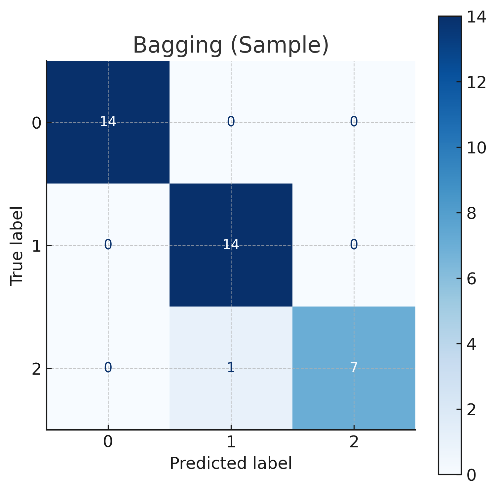
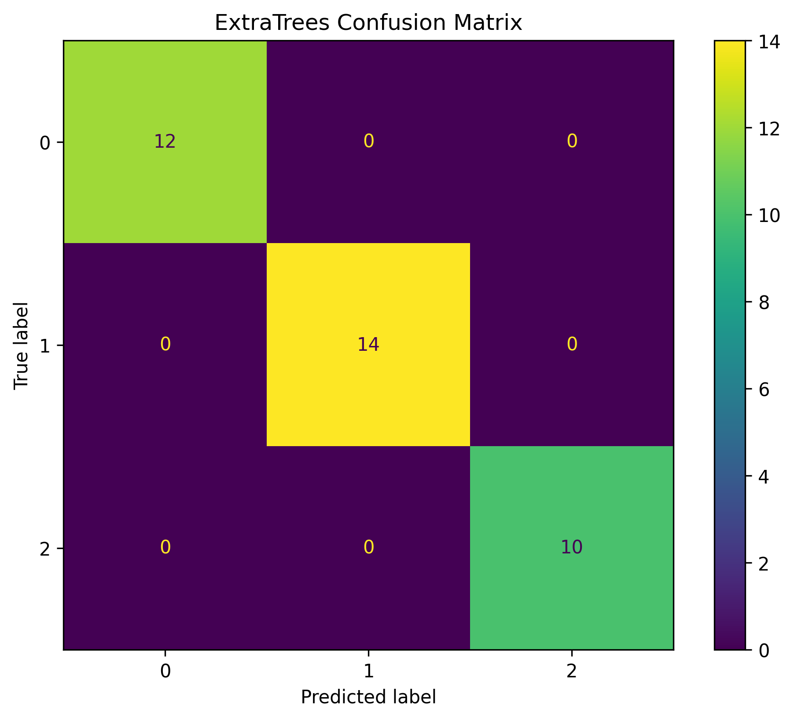
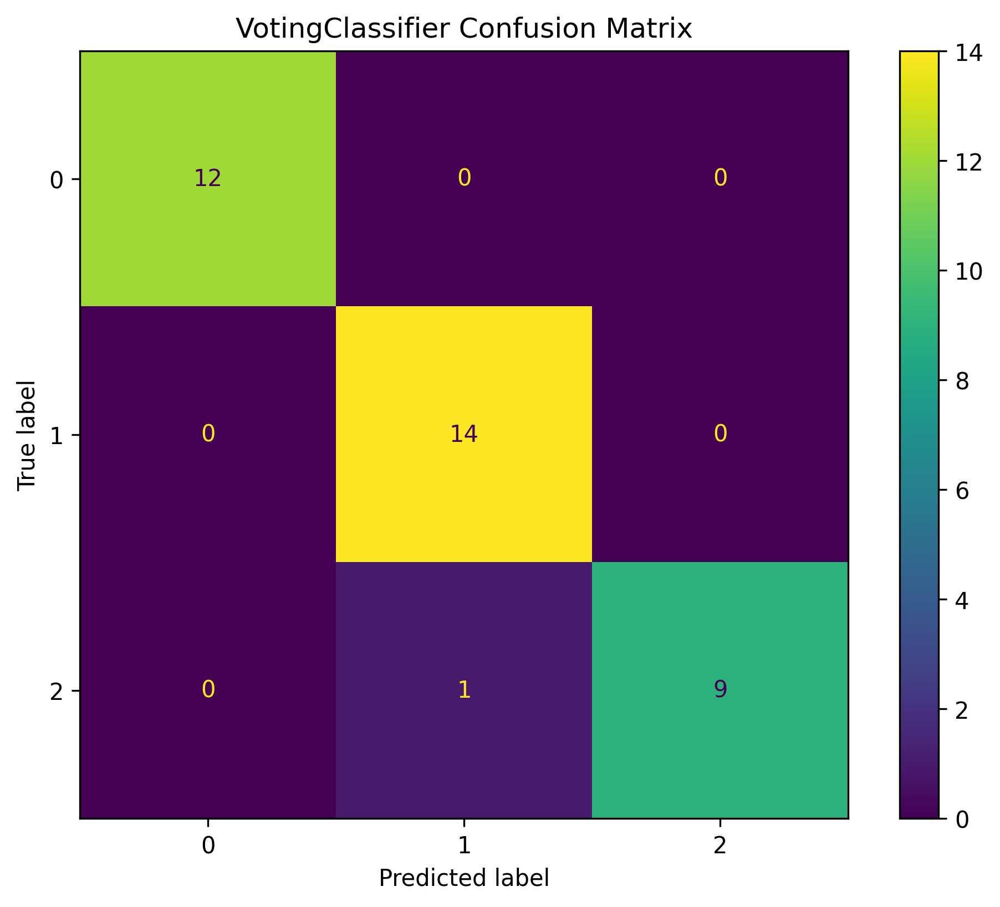
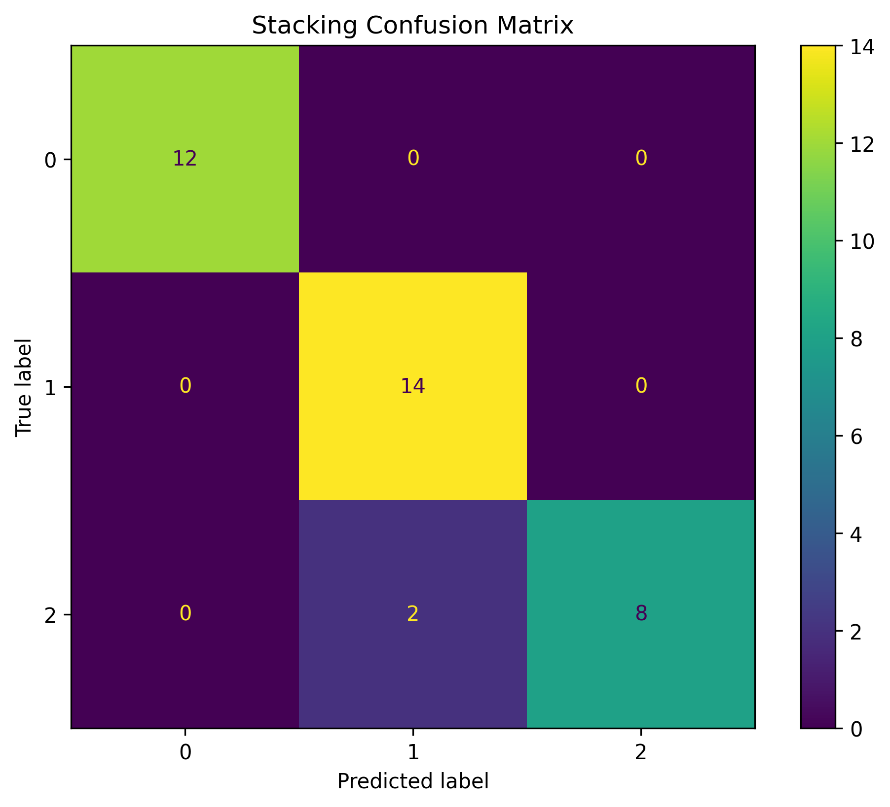

# Ensemble Classifier Learning

This project demonstrates various ensemble learning classifiers, including Bagging, Extra Trees, Voting, and Stacking. The goal is to showcase how these methods can improve the predictive performance of machine learning models. The project uses the Wine dataset for classification and MLflow for experiment tracking.

## Ensemble Learning Concepts

Ensemble methods combine multiple machine learning models to create a more powerful and stable model. Here are the methods implemented in this project:

### 1. Bagging (Bootstrap Aggregating)

**Concept:**
Bagging is an ensemble technique that aims to reduce the variance of a machine learning model. It works by training multiple base models (e.g., decision trees) on different random subsets of the training data. These subsets are created using bootstrapping (sampling with replacement). The predictions of the base models are then aggregated, typically by voting for classification tasks or averaging for regression tasks.

**Mathematical Expression:**
For a classification problem with `M` base models `h_i(x)`, the final prediction `h(x)` is determined by majority vote:

```
h(x) = argmax_{c \in C} \sum_{i=1}^{M} I(h_i(x) = c)
```

where `C` is the set of all possible classes and `I(.)` is the indicator function.

**Real-world Use Cases:**
- **Finance:** Fraud detection and credit risk assessment.
- **Healthcare:** Medical diagnosis and disease prediction.
- **IT:** Network intrusion detection and spam filtering.

### 2. Extra Trees (Extremely Randomized Trees)

**Concept:**
Extra Trees is an ensemble method that, like Random Forest, builds a forest of decision trees. However, it introduces more randomness in the way the trees are built. Specifically, for each feature under consideration, it selects a random split point instead of searching for the optimal one. This often results in a model that is faster to train and can have a lower variance.

**Mathematical Expression:**
The core of Extra Trees lies in the node-splitting process. Instead of optimizing for the best split, it chooses a split at random. The impurity measure, such as Gini Impurity or Entropy, is still used to evaluate the quality of the random splits.

- **Gini Impurity:** `Gini = 1 - Σ (p_i)^2`
- **Entropy:** `Entropy = - Σ (p_i * log₂(p_i))`

where `p_i` is the probability of an item belonging to class `i`.

**Real-world Use Cases:**
- **Feature Importance:** Ranking the importance of features in high-dimensional datasets.
- **Image Classification:** Object recognition and image analysis.
- **Bioinformatics:** Analyzing genetic data.

### 3. Voting Classifier

**Concept:**
A Voting Classifier is an ensemble model that combines the predictions of multiple different machine learning models. It can use either "hard" or "soft" voting.

- **Hard Voting:** The final prediction is the class that receives the majority of votes from the base models.
- **Soft Voting:** The final prediction is based on the average of the predicted probabilities from the base models. This method is usually preferred as it considers the confidence of each model.

**Mathematical Expression:**
- **Hard Voting:** `ŷ = mode{C₁(x), C₂(x), ..., Cₙ(x)}`
- **Soft Voting:** `ŷ = argmax_i Σ_j w_j * p_{ij}`

where `C_j(x)` is the prediction of the j-th classifier, `w_j` is the weight of the j-th classifier, and `p_{ij}` is the predicted probability of class `i` by the j-th classifier.

**Real-world Use Cases:**
- **Fraud Detection:** Combining different fraud detection models to improve accuracy.
- **Medical Diagnosis:** Assisting in more accurate medical diagnoses.
- **Customer Churn Prediction:** Improving the accuracy of customer churn models.

### 4. Stacking (Stacked Generalization)

**Concept:**
Stacking is an ensemble technique that uses a meta-model to learn how to best combine the predictions of several base models. The process involves:
1. Training multiple base models (Level-0 models) on the training data.
2. Using the predictions of these base models as input features to train a new model, called a meta-model (Level-1 model).
3. The meta-model then makes the final prediction.

**Mathematical Expression:**
The final prediction `ŷ` for a new data point `x` is given by:

`ŷ = H(h₁(x), h₂(x), ..., h_L(x))`

where `h_j(x)` are the base models and `H` is the meta-model.

**Real-world Use Cases:**
- **Machine Learning Competitions:** Widely used in platforms like Kaggle to achieve high scores.
- **Recommendation Systems:** Improving the accuracy of movie or product recommendations.
- **Credit Risk Assessment:** Creating more reliable credit scoring models.

## Project Structure

```
ensemble-classifier-learning/
├───README.md                # This file
├───requirements.txt         # Project dependencies
├───run_pipeline.py          # Main script to load data
├───train_models.py          # Script to train and evaluate models
├───data/
│   └───wine.csv             # Dataset
├───images/
│   └───Bagging_confusion_matrix.png  # Output plot
├───models/
│   └───Bagging.joblib       # Saved model
└───src/
    ├───__init__.py
    ├───data_loader.py       # Script to load the dataset
    └───utils.py             # Helper functions to save models and plots
```

## Getting Started

Follow these instructions to set up and run the project on your local machine.

### Prerequisites

- Python 3.8 or higher
- pip (Python package installer)

### Installation

**For Windows:**

1.  **Clone the repository:**
    ```bash
    git clone https://github.com/your-username/ensemble-classifier-learning.git
    cd ensemble-classifier-learning
    ```

2.  **Create and activate a virtual environment:**
    ```bash
    python -m venv venv
    venv\Scripts\activate
    ```

3.  **Install the dependencies:**
    ```bash
    pip install -r requirements.txt
    ```

**For macOS/Linux:**

1.  **Clone the repository:**
    ```bash
    git clone https://github.com/your-username/ensemble-classifier-learning.git
    cd ensemble-classifier-learning
    ```

2.  **Create and activate a virtual environment:**
    ```bash
    python3 -m venv venv
    source venv/bin/activate
    ```

3.  **Install the dependencies:**
    ```bash
    pip install -r requirements.txt
    ```

### Running the Project

1.  **Load the data:**
    The `run_pipeline.py` script is used to load the wine dataset.
    ```bash
    python run_pipeline.py
    ```

2.  **Train the models:**
    The `train_models.py` script will train all the ensemble models, evaluate them, and save the models and confusion matrix plots.
    ```bash
    python train_models.py
    ```

## Model Training and Evaluation

The `train_models.py` script performs the following actions:
- Loads the wine dataset.
- Splits the data into training and testing sets.
- Defines and trains the Bagging, Extra Trees, Voting, and Stacking classifiers.
- Evaluates each model's accuracy.
- Saves the trained models to the `models/` directory.
- Generates and saves confusion matrix plots for each model to the `images/` directory.
- Uses **MLflow** to log experiments, including model parameters and metrics. To view the MLflow UI, run `mlflow ui` in your terminal.

## Model Performance

Here are the confusion matrices for each of the trained models. These plots visualize the performance of the classifiers on the test set.

### Bagging Classifier



### Extra Trees Classifier



### Voting Classifier



### Stacking Classifier




## Contributing

Contributions are welcome! Please feel free to submit a pull request.

## License

This project is licensed under the MIT License.